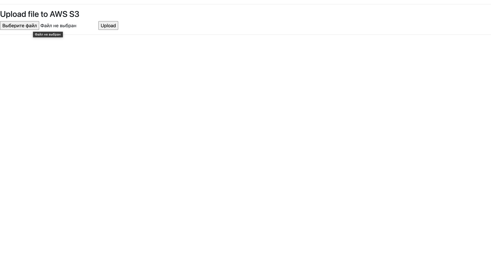
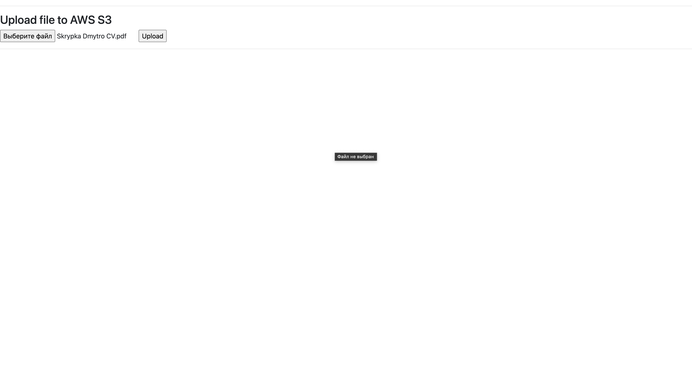
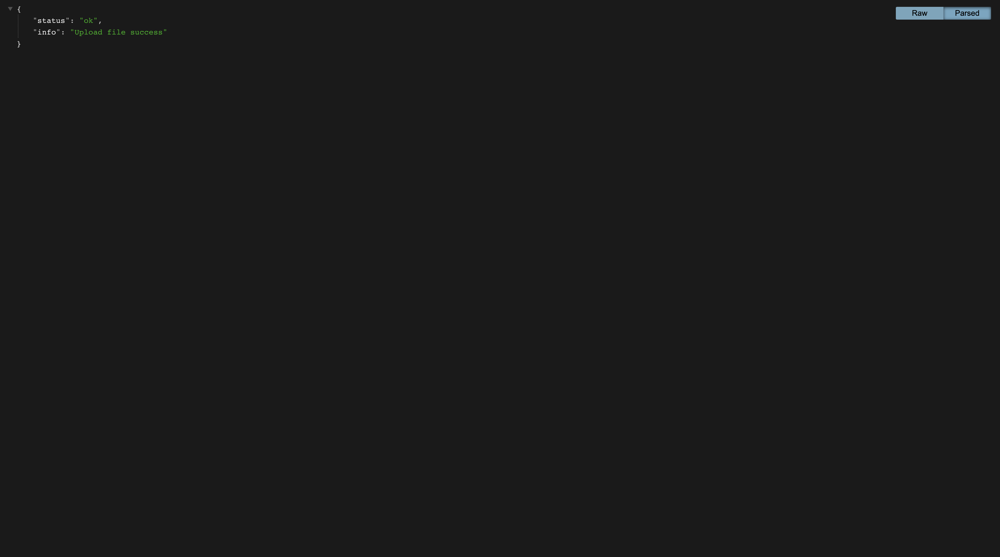
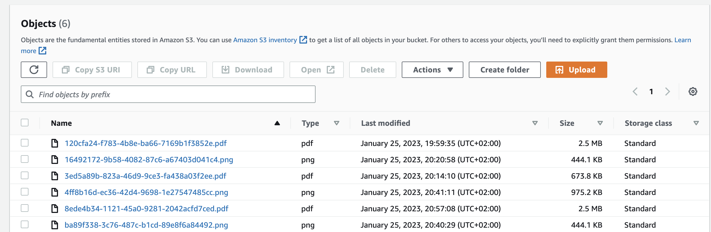

# Nimble API Service

## Installation

Python3 must be already installed

```shell
git clone https://github.com/skrypka-dmytro/Nimble_API_Service.git
python3 -m venv venv
source venv/bin/activate
pip install -r requirements.txt
python3 main.py
```

## Features

### Uploading file to AWS S3

## DEMO



### Chose file



### Upload success



### AWS S3


